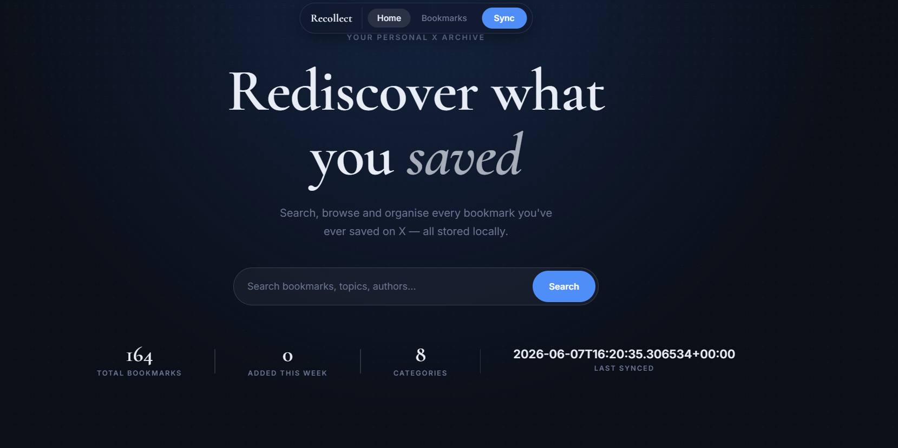
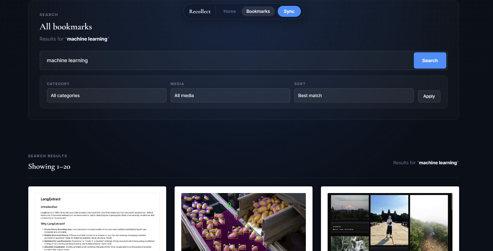
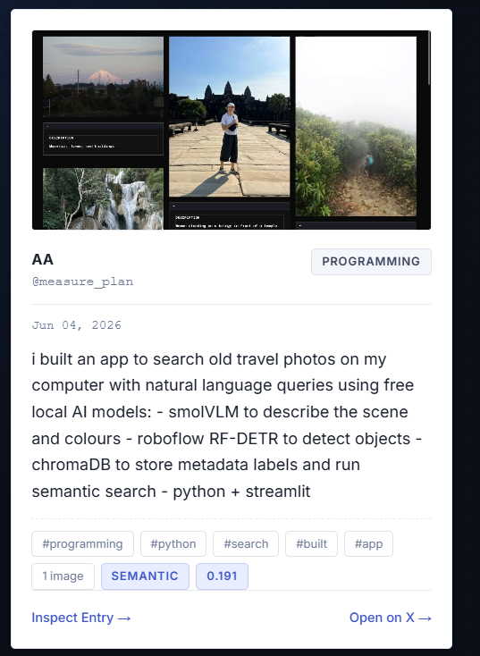

# 🏛️ Accidentally Bookmarked

An elegant, local-first personal knowledge base and search database for your Twitter/X bookmarks. Inspired by the meticulous symmetry, warm color palettes, and nostalgic typography of the **Accidentally Wes Anderson (AWA)** aesthetic.

---

## 📸 Preview Gallery

*Here is a preview of the curated database layout. Place your screenshots in the `images` directory to display them here:*

<!-- PLACEHOLDER FOR MAIN DASHBOARD SCREENSHOT -->
### Main Archive Dashboard


<!-- PLACEHOLDER FOR SEARCH & RESULTS SCREENSHOT -->
### Symmetrical Catalog Search


<!-- PLACEHOLDER FOR BOOKMARK DETAIL VIEW SCREENSHOT -->
### Polaroid Entry Inspection


---

## ✨ Features

- **🎬 Wes Anderson UI/UX Theme**: Symmetrical visual layouts, warm sand/cream paper background (`#f8f3e4`), retro charcoal borders (`#231f20`), and vibrant brand red (`#ee3024`) accents.
- **🖼️ Polaroid-style Bookmark Cards**: Cards styled like vintage Polaroid photographs, complete with typewriter tags, metadata stamps, and flat offset drop shadows.
- **🔍 Hybrid & Semantic Search**: Blends keyword-based FTS5 SQLite query matching with local cosine-similarity embeddings, falling back gracefully if hardware-specific packages (like FAISS on Windows) are missing.
- **🔄 Incremental Sync**: Fully automated bookmark harvesting via Playwright with a persistent, secure local browser profile.
- **🏷️ Automated Categorization**: Leverages local pipelines to parse, extract keywords, and auto-tag bookmarks.
- **📦 Custom Collections**: Group and catalog your entries into distinct thematic binders.

---

## 🚀 Quick Start

Ensure you have [`uv`](https://github.com/astral-sh/uv) installed on your system.

### 1. Initialize the Environment
Install all project dependencies and compile requirements:
```powershell
uv sync --group dev
```

### 2. Install Playwright Dependencies
```powershell
uv run playwright install chromium
```

### 3. Seed Demo Archive (Optional)
Populate your database with sample catalog entries to preview the theme immediately:
```powershell
uv run python scripts/seed_demo.py
```

### 4. Boot the Database Server
Launch the development server:
```powershell
uv run uvicorn bookmarks_organizer.main:app --reload
```
Open [http://127.0.0.1:8000](http://127.0.0.1:8000) in your browser.

---

## 📥 Syncing Your Real Bookmarks

To sync your actual X bookmarks, run the sync helper:
```powershell
uv run python scripts/sync_once.py
```
*Note: A secure Playwright browser instance will launch under `data/browser-profile`. Log in to your X session on the first run, and future runs will fetch your bookmarks incrementally in the background.*

---

## 📂 Project Architecture

```text
├── bookmarks_organizer/   # Main FastAPI web package & logic
│   ├── config.py          # App configuration
│   ├── db.py              # SQLite & Schema layer
│   ├── embeddings.py      # Embedding pipelines
│   └── search.py          # Search service (hybrid & semantic)
├── templates/             # Server-rendered HTML (Jinja + HTMX)
│   ├── base.html          # Symmetrical page structure
│   ├── dashboard.html     # Symmetrical main archive view
│   └── partials/          # Bookmark card and listing modules
├── static/
│   └── style.css          # Customized AWA CSS styles & variables
├── scripts/               # Backup CLI utilities & manual imports
└── tests/                 # System test suite
```

---

## 📜 License

This project is licensed under the MIT License. Peruse and build upon it as you wish!
